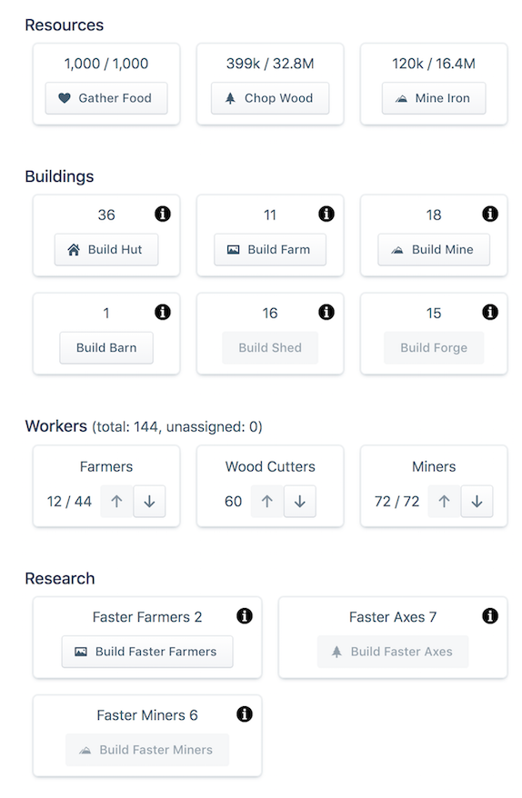

# Idle Component

This is just something I built to explore a few things.

First, I always ran into huge performance problems when I played Idle games -- my laptop fan would go crazy and I'd burn through my battery . I wanted to play around with an idle game built using React to see if React brought any performance gains to the table or if the performance problems were outside of React's scope. So far I haven't run into any perf problems, but I think I got rid of them by only updating state once per second. I may have to play around with that later.

Second, I wanted to make an idle game. They're a pretty pure expression of a certain type of game mechanic, and I wanted to see if I could understand it a bit more.

Third, it seemed like a good playground to understand a bit more about React, Redux, immutable data and things like that.

So here it is. It's a work in progress, and not actually "fun" to play yet, but I'm having fun building it.

This project was bootstrapped with [Create React App](https://github.com/facebook/create-react-app).

## Running it

You'll need a recent version of Node and Yarn. Then:

~~~
yarn install
yarn start
~~~

The game will be running at <http://localhost:3000>.

## Deploying

To make a production build, run

~~~
yarn build
~~~

## Generating ctags

First, install exuberant ctags:

OS X: `brew install ctags-exuberant`

Ubuntu: `sudo apt-get update && sudo apt-get install exuberant-ctags`

RedHat: `sudo yum install ctags`

Follow the instructions here: https://github.com/romainl/ctags-patterns-for-javascript

To generate the ctags:

~~~
ctags -R -e
~~~
